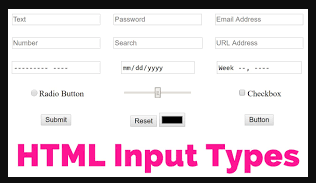

# Gruppen_Javascript

Para uma melhor resoluçao dos exercicios, segue abaixo alguns exemplos da conjunçao Javascript + Html através do Input Forms


## Veja um exemplo bem simples e basico

```
<form>
  <div>
    <label for="uname">Digite seu UserName: </label>
    <input type="text" id="uname" name="name">
  </div>
  <div>
    <button>Submit</button>
  </div>
</form>
```



### Exemplo 001

Um formulario simples com codigo JS para localizar valores

```
<!DOCTYPE html>
<html>
<body>

<form id="frm1" action="/action_page.php">
  First name: <input type="text" name="fname" value="Donald"><br>
  Last name: <input type="text" name="lname" value="Duck"><br><br>
  <input type="submit" value="Submit">
</form> 

<p>Click "Try it" to display the value of each element in the form.</p>

<button onclick="myFunction()">Try it</button>

<p id="demo"></p>

<script>
function myFunction() {
  var x = document.getElementById("frm1");
  var text = "";
  var i;
  for (i = 0; i < x.length ;i++) {
    text += x.elements[i].value + "<br>";
  }
  document.getElementById("demo").innerHTML = text;
}
</script>

</body>
</html>
```

### Exemplo 002

Uma pegadinha na vibe do Select Opiont 

```
<!DOCTYPE html>
<html>
<head>
<script>
function changeText() {
  x = document.getElementById("mySelect");
  x.options[x.selectedIndex].text = "Melon";
}
</script>
</head>
<body>

<form>
Select your favorite fruit:
<select id="mySelect">
  <option>Apple</option>
  <option>Orange</option>
  <option>Pineapple</option>
  <option>Banana</option>
</select>
<br><br>
<input type="button" onclick="changeText()" value="Set text of selected option">
</form>

</body>
</html>
```

## Sua vez

Agora que viu estes pequenos exemplos, espero que tenha terminado os cursos da DIO apresentados nas atividades antetiores.

Como tarefa, faça algumas pagina em HTML com Forms Input e faça algumas validaçoes com codigo JAVASCRIPT. Abaixo deixo links com mais modelos e exemplos.

Boa atividade

[Saiba mais sobre HTML Input Forms e Javascript](https://www.w3schools.com/js/js_input_examples.asp)

[Mozilla Input Forms](https://developer.mozilla.org/en-US/docs/Web/HTML/Element/input/text)