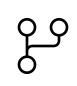

<!-- PROJECT SHIELDS -->

[![Contributors][contributors-shield]][contributors-url]
[![Forks][forks-shield]][forks-url]
[![Stargazers][stars-shield]][stars-url]
[![Issues][issues-shield]][issues-url]
[![MIT License][license-shield]][license-url]
[![LinkedIn][linkedin-shield]][linkedin-url]

<!-- PROJECT LOGO -->

# Gruppen_Javascript

Bem vindo a nosso Javascript Gruppen.

#  Ingresse no Javascript Gruppen

Participe de um grupo de estudos em Javascript. Juntos vamos treinar codificação e comandos para aprimorarmos nossos hard skills nesta fabulosa linguagem.

## Pré-requisitos

- Bootcamp Web Developer

- Bootcamp Javascript Game Developer

- Boa vontade

- Curiosidade em aprender

- Gostar de programar

  

##   Fork / clone este repositório

Faça as atividades, seja honesto consigo mesmo, treinando e trocando ideias com outros membros

<a href="Atividades">Conclua as atividades</a>
 

##  Codifique

- VS Code [Download](https://code.visualstudio.com/download)

- notepad ++ [Download](https://notepad-plus-plus.org/downloads/)

- edit plus [Download](https://www.editplus.com/download.html)

- qualquer editor de texto a sua escolha

  

##    Debug

- NodeJS [Download](https://nodejs.org/en/download/)

- Consola do navegador

  

Sem pressão e sem prazo, siga a sua propria velocidade.

[Conheças as atividades em nosso Gruppen](ListaAtividade.Md)

<!-- MARKDOWN LINKS & IMAGES -->
<!-- https://www.markdownguide.org/basic-syntax/#reference-style-links -->
[contributors-shield]: https://img.shields.io/github/contributors/VagnerBellacosa/Gruppen_Javascript.svg?style=for-the-badge
[contributors-url]: https://github.com/VagnerBellacosa/Gruppen_Javascript/graphs/contributors
[forks-shield]: https://img.shields.io/github/forks/VagnerBellacosa/Gruppen_Javascript.svg?style=for-the-badge
[forks-url]: https://github.com/VagnerBellacosa/Gruppen_Javascript/network/members
[stars-shield]: https://img.shields.io/github/stars/VagnerBellacosa/Gruppen_Javascript.svg?style=for-the-badge
[stars-url]: https://github.com/VagnerBellacosa/Gruppen_Javascript/stargazers
[issues-shield]: https://img.shields.io/github/issues/VagnerBellacosa/Gruppen_Javascript.svg?style=for-the-badge
[issues-url]: https://github.com/VagnerBellacosa/Gruppen_Javascript/issues
[license-shield]: https://img.shields.io/github/license/VagnerBellacosa/Gruppen_Javascript.svg?style=for-the-badge
[license-url]: https://github.com/VagnerBellacosa/Gruppen_Javascript/blob/master/LICENSE.txt
[linkedin-shield]: https://img.shields.io/badge/-LinkedIn-black.svg?style=for-the-badge&logo=linkedin&colorB=555
[linkedin-url]: https://www.linkedin.com/in/VagnerBellacosa/
[product-screenshot]: Images/Welcome.png
